# Cutty Field Control OS: The Autonomous Enterprise Environment

*A pitch-ready breakdown of the next-generation CRM and Field Service Management platform, powered by Google's Gemini AI.*

---

## 🚀 The Cutty Advantage: Redefining the CRM

Traditional CRMs are passive repositories—they wait for humans to input data, resolve scheduling conflicts, and remember to follow up on unpaid invoices. They are static tools that require constant manual labor to maintain.

**Cutty OS is different. It is an Agentic, Autonomous Environment.**

Built from the ground up with **Google's Gemini AI** embedded into its core architecture via our proprietary *Brain Service*, Cutty doesn't just store your data; it actively manages your business alongside you. It predicts, it routes, it communicates, and it secures. It transforms unstructured field chaos—like a hurried voice note from a crew chief or a messy text from a client—into structured, actionable, and revenue-generating workflows.

This isn't a CRM with an AI chatbot slapped on the side. This is an Enterprise Copilot where AI is the operating system.

---

## 📸 Core Modules: A Visual and Functional Deep Dive

Below is an exhaustive breakdown of the operational interfaces, client-facing portals, and backend infrastructure that make Cutty OS an industry-leading platform.

### 1. The Operational Cockpit (Dashboard)

The nerve center of the business. The Operational Cockpit replaces fragmented spreadsheets with a unified, real-time command center.
*   **The Gemini Difference:** The dashboard features deep integration with the Cutty Copilot. Instead of digging through reports, owners can ask natural-language questions like, *"What's our projected revenue this week based on the current weather forecast?"* and receive immediate, context-aware answers.
*   **Key Features:** Live financial telemetry, customizable widget architecture, and quick-action macros that allow dispatchers to execute complex, multi-step tasks with a single click.

### 2. Crew Suite: Hands-Free Field Mobility
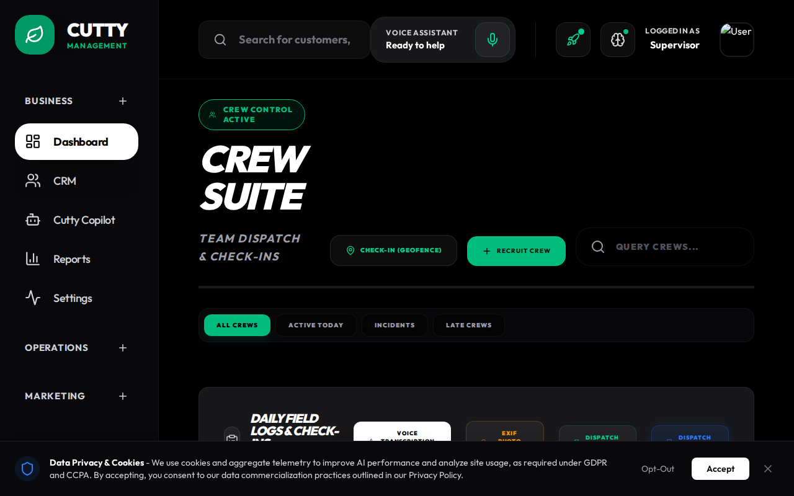
The field is chaotic; the Crew Suite brings order. Designed for extreme mobility, this mobile-first interface connects the office to the frontline instantly.
*   **The Gemini Difference:** Voice-to-text intelligence allows crew chiefs to log job completion notes, report hazards, or request materials entirely hands-free while driving or working.
*   **Key Features:** Real-time GPS shift tracking, secure job-site photo processing (photos are only accepted while actively "on the clock" to prevent fraud), and automated, verifiable timecards that prove work completion to clients instantly.

### 3. Design Studio: Creative Precision & AI Material Estimation
The Design Studio is where creative planning meets operational execution and hard data.

**The Workspace View:**
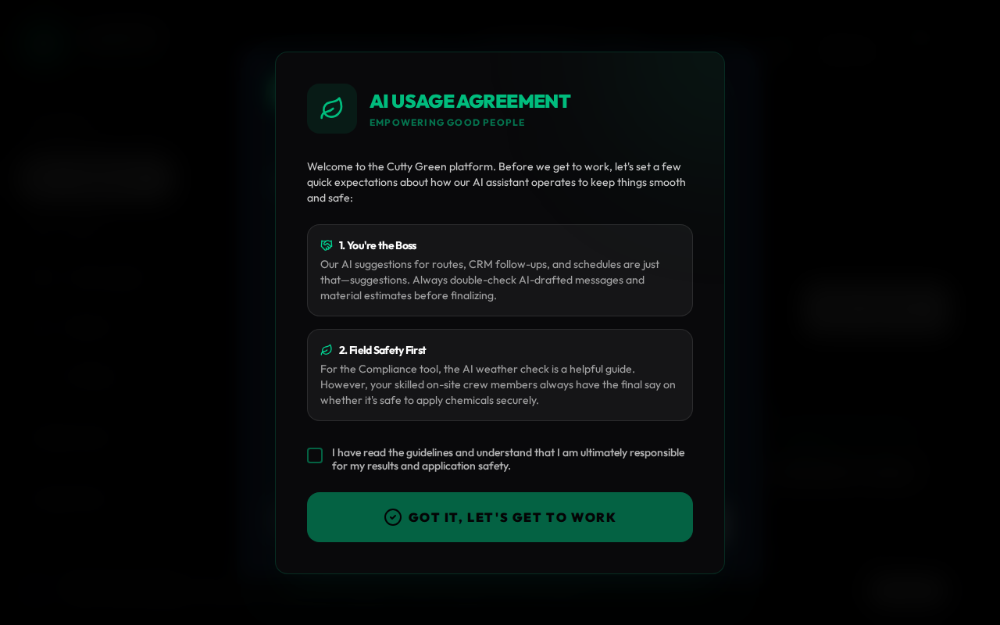
*   **Key Features:** Interactive mapping and markup tools. Designers can sketch layouts directly over uploaded property photos or satellite imagery.

**AI Analysis & Tiered Estimation:**
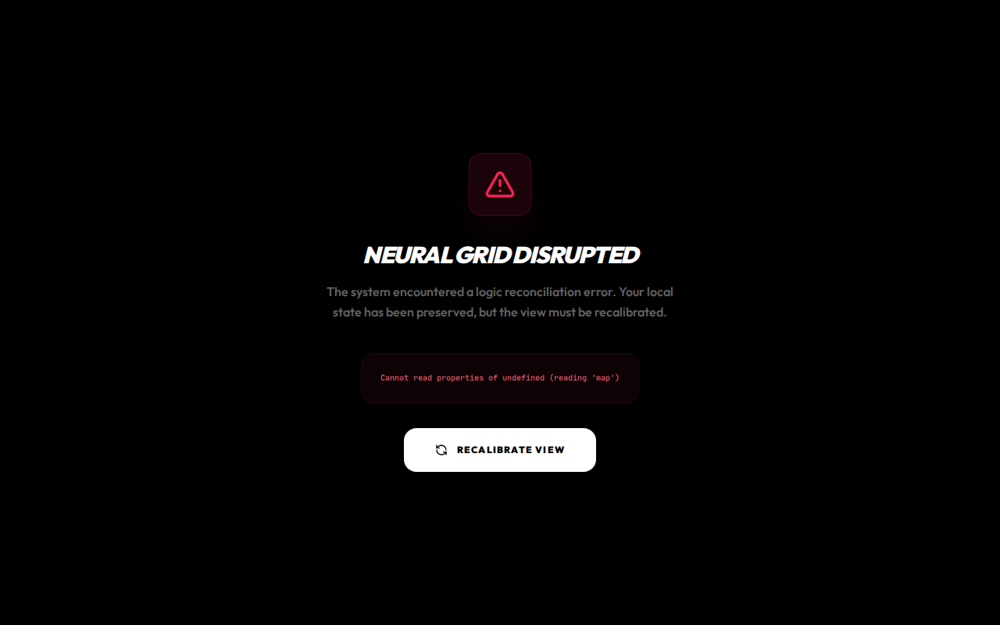
*   **The Gemini Difference:** Once a design is plotted, Gemini instantly analyzes the spatial data to generate a comprehensive Bill of Materials. It cross-references the internal catalog to estimate labor costs and provides *Tiered Pricing* (Standard, Good, Better, Best), allowing contractors to immediately up-sell clients based on material quality—all generated automatically from a single photo and voice prompt.

**The Design Database:**

*   **Key Features:** A secure, searchable repository of all past designs, botanical rules, and architectural guidelines. The AI uses this database to ensure all new designs are contextually accurate and botanically viable.

### 4. Smart Inventory: Predictive Procurement
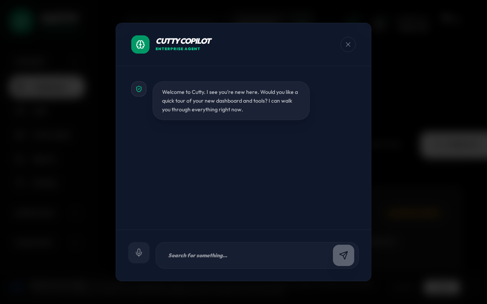
Manual inventory counting is dead. Cutty’s inventory module is a self-monitoring ecosystem.
*   **The Gemini Difference:** The AI constantly analyzes upcoming scheduled jobs against historical usage rates. If the system knows you have 40 properties scheduled for mulch next week, it will preemptively flag a low-stock warning *before* you run out, ensuring crews are never grounded waiting on supplies.
*   **Key Features:** Instant device-camera barcode scanning for rapid ingress/egress, real-time stock levels, and automated supplier reorder drafting.

### 5. AI-Powered CRM: Revenue-Generating Automation
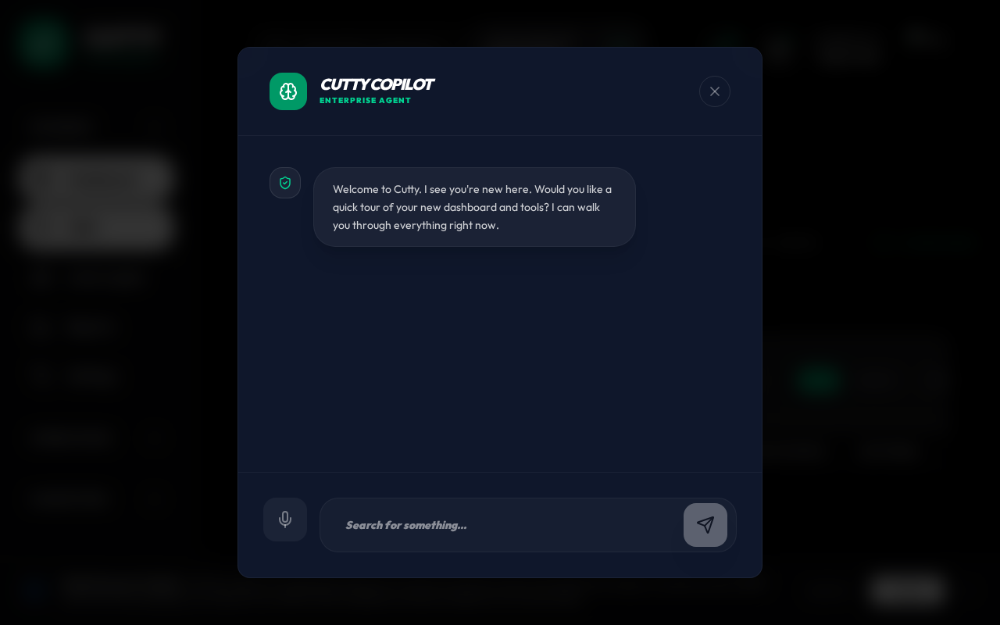
The engine of client relationship growth and retention.
*   **The Gemini Difference:** Agentic Outreach. The CRM doesn't just hold phone numbers; it works them. The Copilot can automatically draft highly personalized follow-up emails, renewal estimates, and service summaries based on the specific history of that client's property.
*   **Key Features:** **Strict Tenant Isolation** guarantees client data is never cross-contaminated. **Pure Data Portability** ensures business owners are never locked in—full exports are available at any time.

### 6. The Cutty Agent: Your Enterprise Copilot
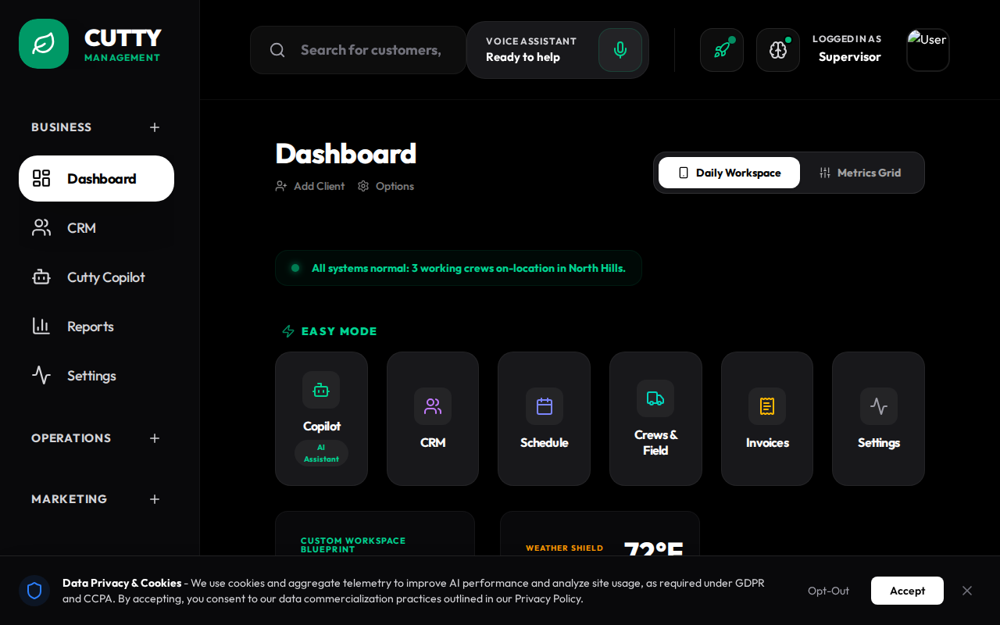
A dedicated, secure chat environment for interacting with the AI.
*   **The Gemini Difference:** This is a *bounded* AI. Its actions are strictly confined to permitted enterprise workflows, ensuring deterministic, safe results without hallucination risks on sensitive data.
*   **Key Features:** **Omnilingual Real-Time Translation** breaks down language barriers instantly, allowing a Spanish-speaking crew chief to communicate seamlessly with an English-speaking dispatcher.

### 7. Scheduler & Dispatch: Conflict-Free Operations
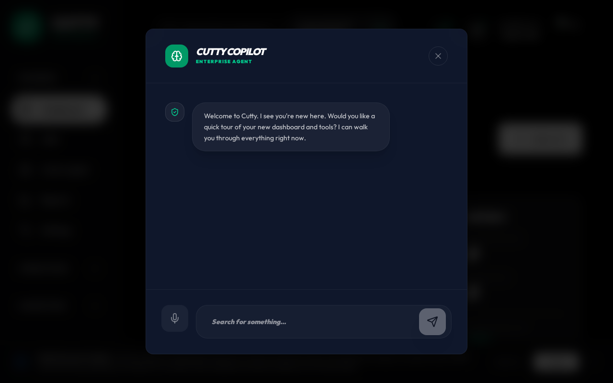
A unified, hyper-responsive drag-and-drop dispatch board.
*   **The Gemini Difference:** The AI acts as a silent traffic controller. It instantly flags scheduling conflicts, unrealistic travel times between jobs, or overlapping crew assignments, automatically suggesting optimized alternatives.

### 8. Route Optimizer: Maximizing Margins
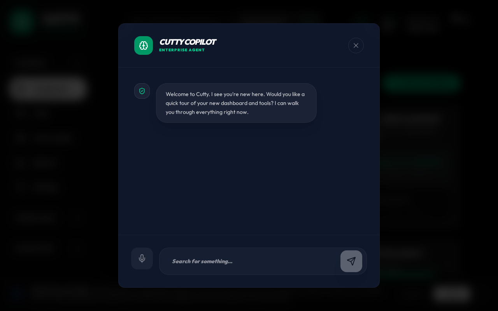
Fuel and drive time are the silent killers of service margins. The Route Optimizer crushes both.
*   **The Gemini Difference:** Dynamic, algorithmic route recalculation that reacts to emergency dispatches or traffic disruptions in real-time, constantly re-shuffling the day's tasks for maximum geographic density.

### 9. Invoices & Billing: Frictionless Capital
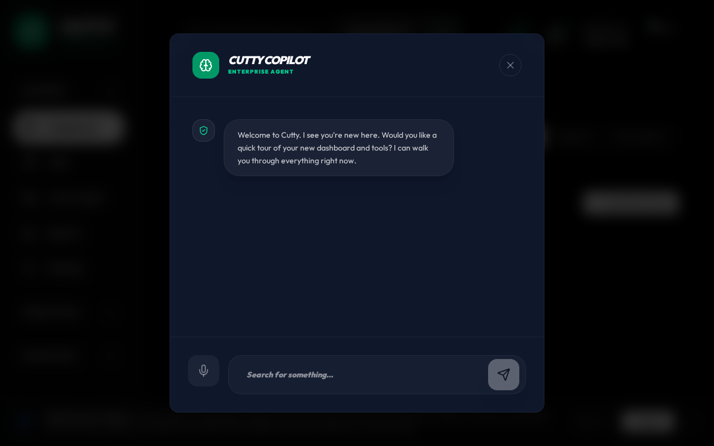
Get paid faster with zero manual data entry.
*   **The Gemini Difference:** The AI cross-references completed jobs in the scheduler with the CRM contract terms to automatically generate and queue precise invoices. It can also manage polite, automated follow-ups for overdue balances.
*   **Key Features:** Seamless Stripe integration for instant credit card and ACH processing directly through the client portal.

### 10. Reports & Analytics: Actionable Intelligence
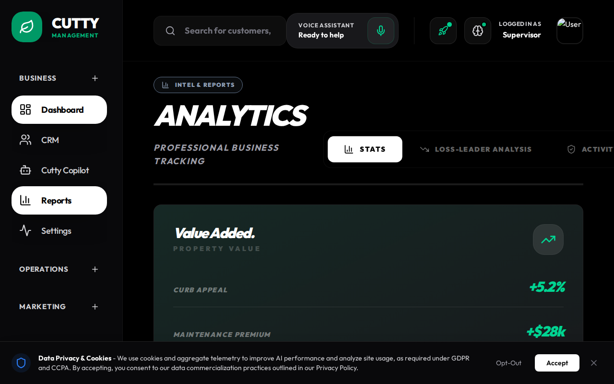
Deep, visual dives into the health of the enterprise.
*   **Key Features:** Beautiful, interactive charting components detailing revenue trends, crew efficiency metrics, and granular service profitability tracking.

### 11. Client Portal: The Branded Gateway
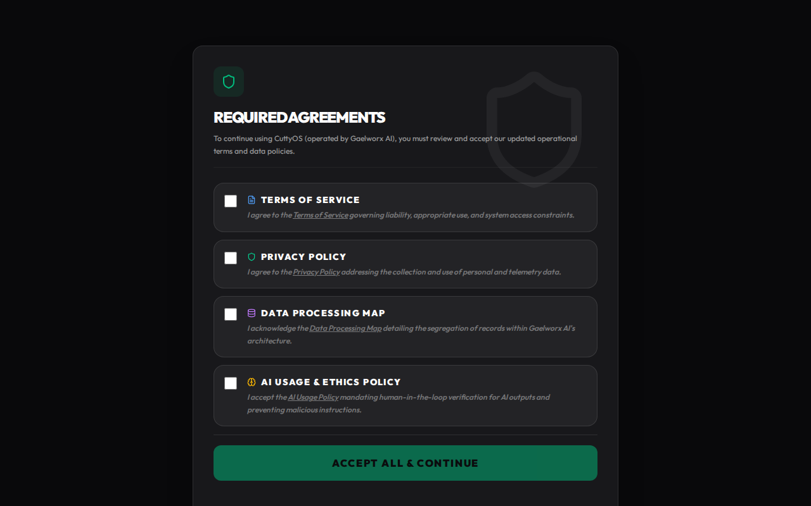
A frictionless, white-labeled experience for the end customer.
*   **Key Features:** Magic link authentication completely eliminates the need for clients to remember passwords. Clients can securely view job histories, approve estimates, and pay invoices in seconds.

### 12. Reviews & Portfolio: Automated Reputation
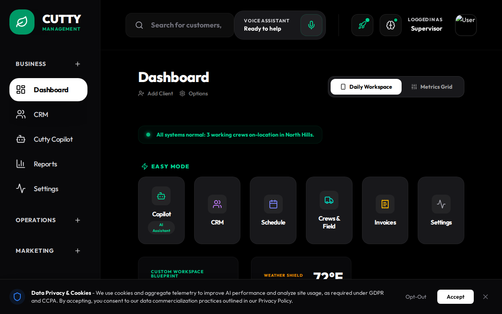 | 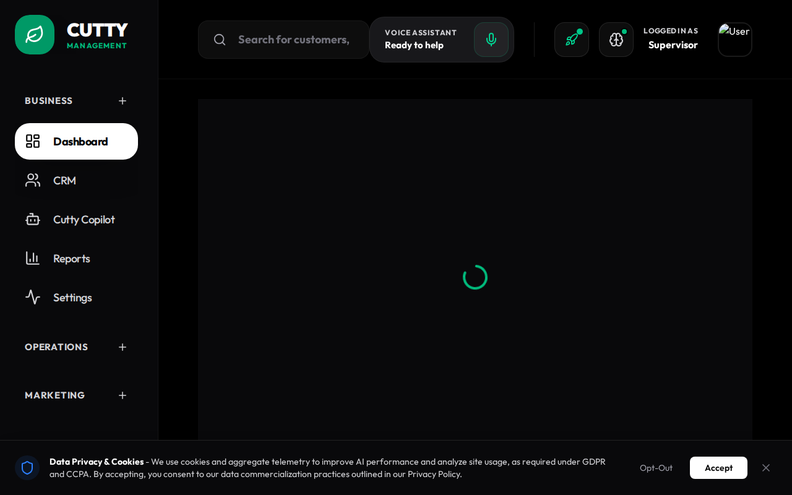
Turn completed work into new leads effortlessly.
*   **The Gemini Difference:** The system automatically identifies high-margin, successful jobs and prompts the client for a review upon completion. It also curates the best field photos into a public-facing portfolio to drive new business.

### 13. Settings & Tenant Admin: Total Control

The command layer for business owners.
*   **Key Features:** Granular Role-Based Access Control (RBAC), secure integration management, and comprehensive, immutable audit logging for every action taken within the system.

### 14. Compliance & Contracts: Legal Ironclad
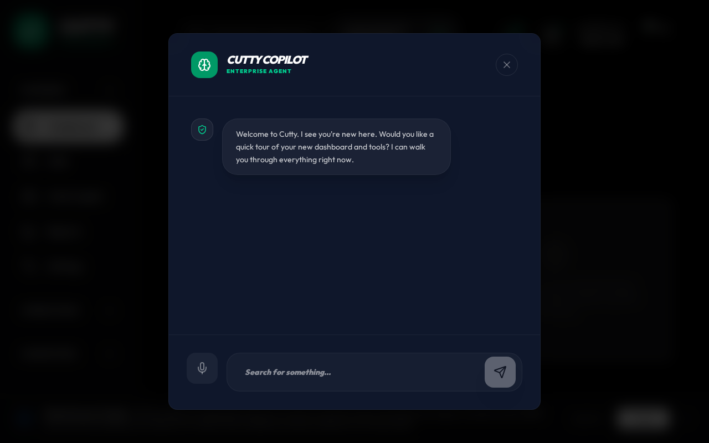 | 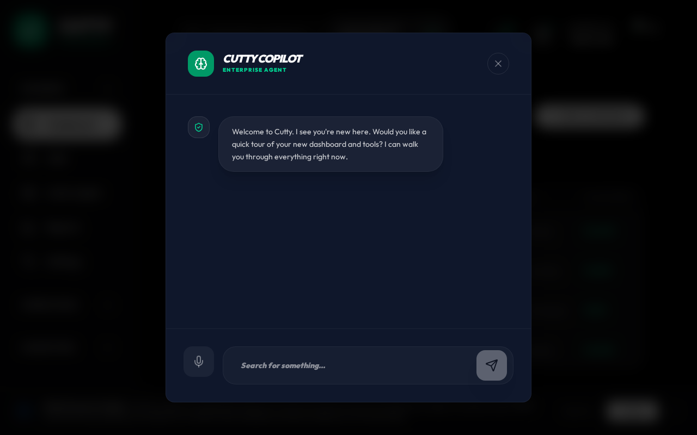
Built to exceed enterprise legal standards.
*   **Key Features:** Automated document generation for EULAs, NDAs, and Service Agreements. Digital signatures are tracked and stored immutably on the tenant record.

---

## 🏛️ Radical Legal Transparency

Cutty OS believes in the moral handshake: good people empowering good people. We built interactive, AI-summarized legal readers so business owners and their clients have ultimate transparency into how their data is handled.

*   **Data Processing Map:** 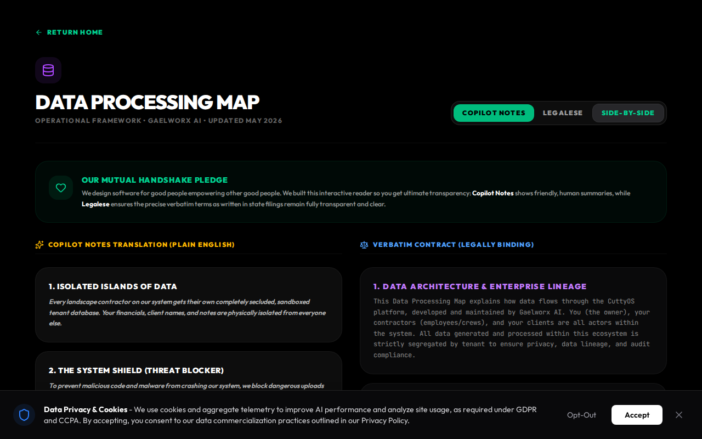
*   **AI Usage & Ethics Policy:** 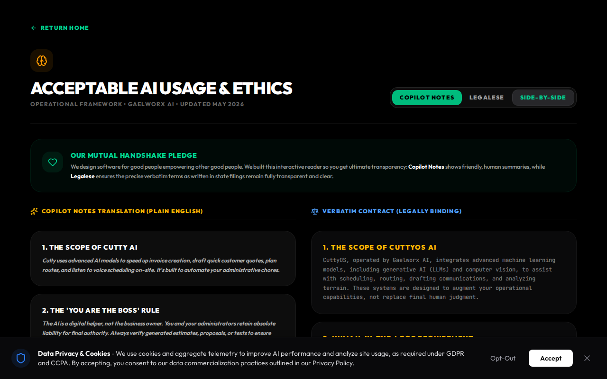
*   **Terms of Service:** 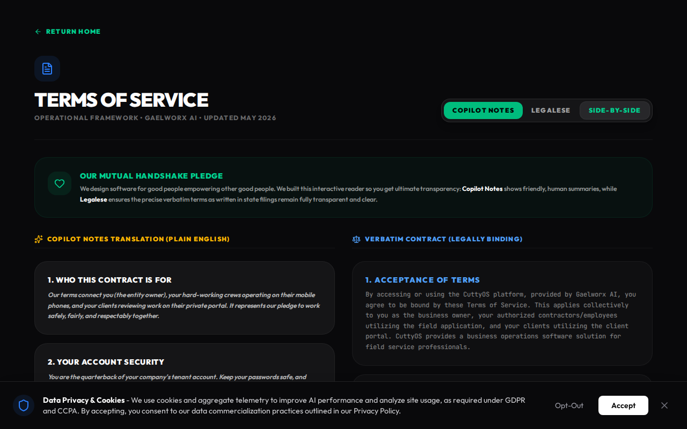
*   **Privacy Policy:** 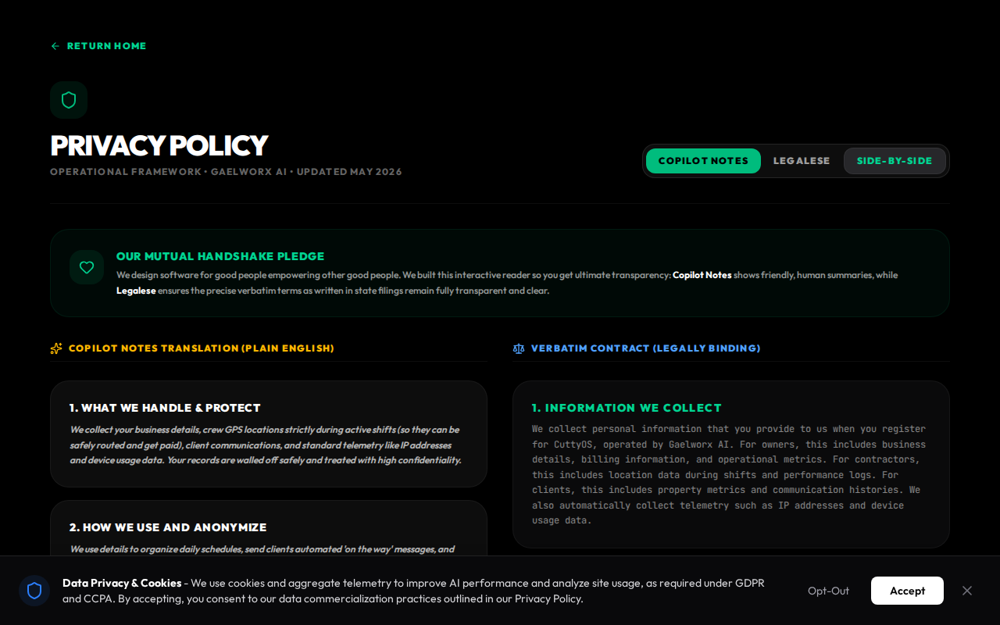

---

## 🛡️ Uncompromising Security Architecture

Cutty OS doesn't just promise security; it enforces it at the deepest levels of the stack.

1.  **Tenant Data Isolation:** Every contractor operates within a completely secluded, sandboxed database. Strict Firestore rules physically prevent cross-tenant data queries.
2.  **The System Shield (Threat Blocker):** Active middleware scans and blocks malicious uploads (e.g., `.exe`, shell scripts) before they ever reach the storage layer.
3.  **Row-Level Security (RLS) & JWT Validation:** Every API call and data request is verified against strict, immutable cryptographic tokens.
4.  **Compliance Ready:** The infrastructure is purposefully built to support SOC2, GDPR, CCPA, and PCI compliance standards out of the box.

Cutty OS isn't just software. It is a secure, intelligent, and autonomous operating system built to scale modern service businesses.
